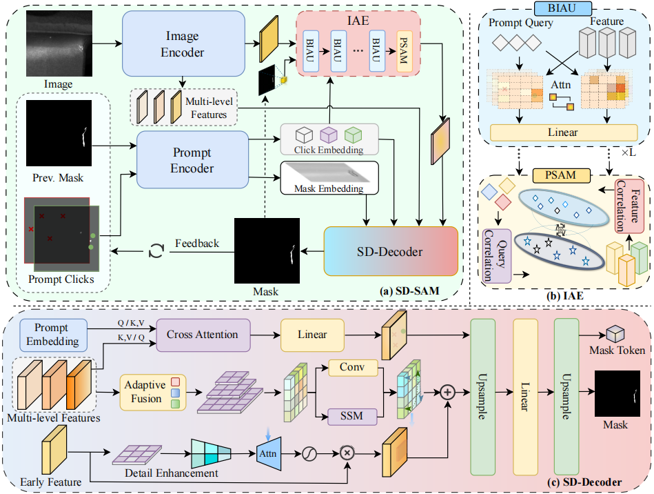

# Prompt-aware Feature Recomposition for Interactive Defect Segmentation (SD-SAM)

PyTorch implementation of the paper: **"Prompt-aware Feature Recomposition for Interactive Defect Segmentation"**, accepted by **IEEE Transactions on Industrial Informatics (TII)**.

---


---

## 🚩 News
- [2026/04] 🌟 The source codes have been released.
- [2026/04] 🎉 Our article is accepted by *IEEE Transactions on Industrial Informatics (TII)*.

## 🚀 Overview
  

This repository contains the official code for SD-SAM, a specialized framework designed for interactive surface defect segmentation under complex industrial environments.

## 🛠️ Installation

1. Clone the repository:
```sh
git clone https://github.com/MengAAA/SD-SAM.git
cd sd-sam
```

2. Install dependencies:
```sh
pip install -r requirements.txt
```

## 📊 Dataset Preparation

Two of them are public benchmark datasets: NEU-SEG and Concrete3k, while the third one is our proposed Aero-Seg dataset.

## 🏋️ Training and Evaluation

To train the SD-SAM from scratch:
### Training (SD-Decoder)
Single GPU:
```sh
export PYTHONPATH=.
python tools/train.py configs\hqsam\x-sdsam\train_hqnext_qh_vwv0_3.py
```
### Training (IAE)
Single GPU:
```sh
export PYTHONPATH=.
python tools/train.py configs\hqsam\x-sdsam\train_aespa_aero_sdsam_re.py
```

To evaluate the model with a pre-trained checkpoint:
### Evaluation
Single GPU:
```sh
export PYTHONPATH=.
python tools/test_no_viz.py configs\_base_\eval_aespa_aero_val.py your_path_of_your_pretrained_checkpoint
```
> *Note: Please replace the paths above with your actual local directories.*

## 📄 License
MIT License
